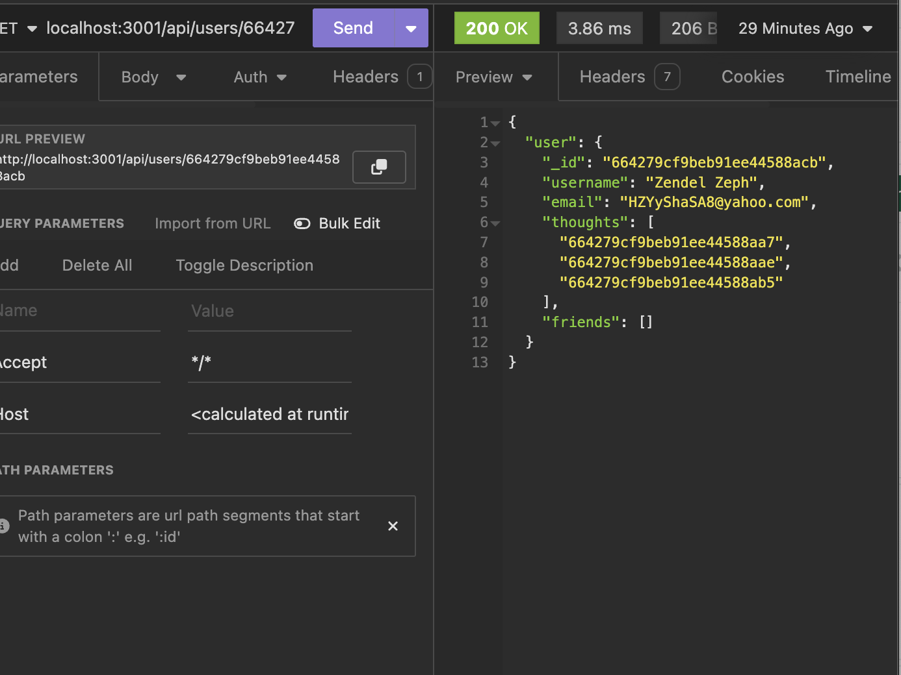

# Social Networking API
This project has three parts

Introduction
Problem
Solution

## Introduction

MongoDB is a popular choice for many social networks due to its speed with large amounts of data and flexibility with unstructured data. 

This project is to build an API for a social network web application where users can share their thoughts, react to friends’ thoughts, and create a friend list. For this  Express.js for routing, a MongoDB database, and the Mongoose ODM are used. 

## Problem

Inorder to run the localhost application in insomia was abit challenging . To understand the correct route for users and thoughts and challenging 

## Solution

GIVEN a social network API
WHEN I enter the command to invoke the application
THEN my server is started and the Mongoose models are synced to the MongoDB database
WHEN I open API GET routes in Insomnia for users and thoughts
THEN the data for each of these routes is displayed in a formatted JSON
WHEN I test API POST, PUT, and DELETE routes in Insomnia
THEN I am able to successfully create, update, and delete users and thoughts in my database
WHEN I test API POST and DELETE routes in Insomnia
THEN I am able to successfully create and delete reactions to thoughts and add and remove friends to a user’s friend list

## Mock Up

The following animations show examples of the application's API routes being tested in Insomnia

